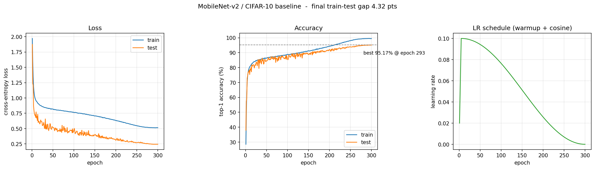
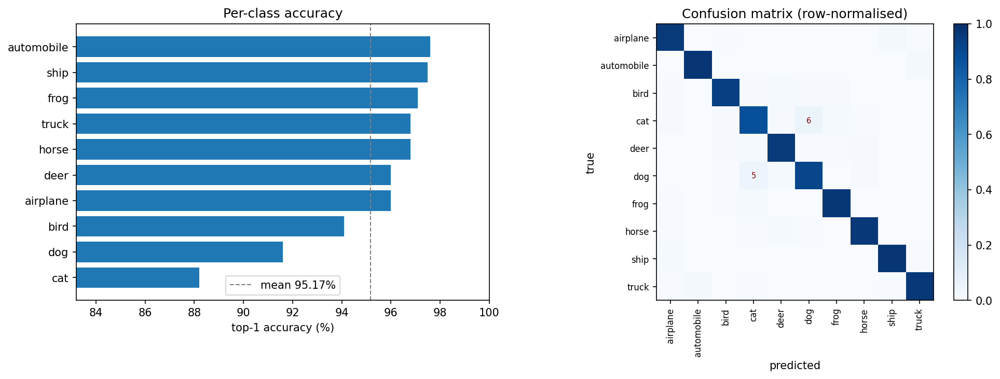
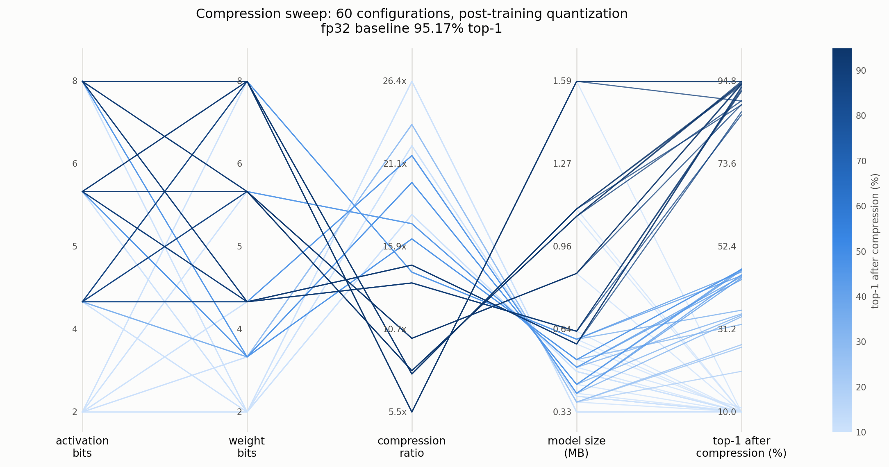
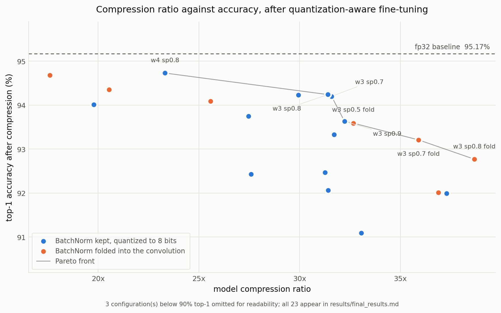

**Repository:** https://github.com/preethibosco/CS6886-A2

## Summary

| | |
|---|---|
| Accuracy without compression | **95.17%** top-1 |
| Model size, fp32 | 8.662 MB (2,270,794 values) |
| Best model compression ratio | **35.90x** |
| Best weight compression ratio | **35.09x** |
| Best activation compression ratio | **4.00x** |
| Accuracy after compression | **93.21%** (-1.96) |
| Final model size | **0.241 MB** |
| Storage overheads | see Q2(c) |
| Wandb parallel coordinates | Figure 3 |

The reported configuration is 3-bit weights, 8-bit activations,
70% sparsity, BatchNorm folded into the convolutions.

## Q1. Training baseline

### (a) Data preparation

Normalisation uses the CIFAR-10 training-set channel statistics, mean
(0.4914, 0.4822, 0.4465) and standard deviation (0.2470, 0.2435, 0.2616).

Train transforms, in order:

1. `RandomCrop(32, padding=4)`. Pad 4 px each side, then crop back to 32x32.
2. `RandomHorizontalFlip(p=0.5)`.
3. `ToTensor()`. HWC uint8 to CHW float in [0,1].
4. `Normalize(mean, std)`.
5. `RandomErasing(p=0.25, scale=(0.02, 0.20))`. Applied after normalisation, so
   the erased patch is filled at the channel mean.

Test transforms: `ToTensor()` and `Normalize` only.

A third split of 1024 images is drawn from the training set with the test-time
transform. It is used only to calibrate activation ranges, so that no clipping
threshold is ever fitted on test data.

### (b) Model and training configuration

MobileNet-v2 is implemented from scratch rather than imported. The ImageNet
configuration downsamples 32x, which on a 32x32 input reaches a 1x1 feature map
by the c=64 stage. We remove two downsampling steps, the stem stride and the
c=24 stage stride, both from 2 to 1. That gives 8x total downsampling and a 4x4
final feature map. Everything else follows the paper.

| Setting | Value |
|---|---|
| Width multiplier | 1.0 |
| Dropout (before classifier) | 0.2 |
| BatchNorm momentum | 0.05 |
| Parameters | 2,236,682 (8.532 MB fp32) |
| BatchNorm running buffers | 34,112 (0.130 MB) |
| Optimiser | SGD, momentum 0.9, Nesterov |
| Learning rate | 0.1, 5-epoch linear warmup then cosine to 0.0 |
| Weight decay | 0.0005, not applied to BatchNorm, biases or depthwise weights |
| Label smoothing | 0.1 |
| Epochs / batch size | 300 / 128 |
| Precision | bfloat16 autocast |
| Seed | 42 |

Weight decay is withheld from the depthwise convolutions because each channel
holds only 9 weights, so the same decay that is mild for a 960x160 pointwise
convolution is a strong pull toward zero here and can remove channels entirely.

### (c) Results

Final test top-1 is **95.17%** at epoch 293, against
99.46% on the training set, a gap of
4.29 points. Curves are in Figure 1.

In Figure 1 the test loss sits below the train loss for the whole run. This is
not an error: the training loss includes label smoothing and is measured on
augmented images, while the test loss is plain cross-entropy on clean ones. The
accuracy panel shows the real generalisation gap.

Errors are concentrated in one class pair rather than spread across the ten
classes:

| Class | Top-1 | Most confused with |
|---|---|---|
| cat | 88.20% | dog (6.2%) |
| dog | 91.60% | cat (4.9%) |
| bird | 94.10% | deer (1.4%) |

The eight rigid-body classes are all at or above 94%. cat and dog form a single
reciprocal confusion pair; at 32x32 the texture cues that separate them are near
the resolution limit. Per-class accuracy and the confusion matrix are in Figure 2.

## Q2. Compression implementation

### (a) Method

Four stages, all written from scratch. No quantization, pruning or compression
library is used anywhere; `scripts/conformance.py` enforces this with an AST scan
of the source tree.

**1. Pruning** (`src/compress/prune.py`). Fine-grained magnitude pruning with a
single global threshold across the prunable layers, capped so no layer exceeds
95% sparsity. A global threshold lets the network decide where sparsity belongs
instead of forcing every layer to the same ratio.

Surviving weights need their positions recorded. Two encodings are implemented
and the cheaper one is chosen per layer:

* *bitmap*: one presence bit per weight plus codes for the survivors. Costs
  `N + nnz*b` bits.
* *relative index*: a delta to the previous survivor, with filler entries when
  a gap exceeds the largest representable delta. Costs `entries*(b + index_bits)`.

The delta width is searched per layer over 3, 4, 5, 6 and 8 bits rather than
fixed at the 4 bits used in Deep Compression. A 4-bit delta spans 15 positions,
so at 98% sparsity the mean gap exceeds it and filler entries outnumber real
values roughly 3:1. Searching the width recovers 30% of the encoded size at 95%
sparsity and 60% at 98%.

**2. Weight quantization** (`src/compress/weight_share.py`, `quantize.py`).
Three methods are implemented and selectable: k-means weight sharing (Lloyd's
algorithm, linear centroid initialisation), linear quantization per output
channel, and linear quantization per tensor. Symmetric quantization is used for
weights throughout:

$$q = \mathrm{clamp}(\mathrm{round}(x/s), -2^{b-1}+1, 2^{b-1}-1), \qquad s = \max|x| / (2^{b-1}-1)$$

**3. Huffman coding** (`src/compress/huffman.py`). Canonical Huffman over the
quantized codes and over the index deltas, coded separately. Canonical form means
the table is one code length per symbol rather than a serialised tree. Entropy
coding is applied only where it wins: on short streams the table exceeds the
saving, and the raw stream is kept instead.

**4. Activation quantization** (`src/compress/quantize.py`). Ranges are observed
on the calibration split as an exponential moving average of per-batch 99.99th
percentiles, then frozen. The scheme differs by site: tensors after ReLU6 are
one-sided in [0,6] and use asymmetric quantization, so all 2^b codes fall in the
range that occurs; tensors after a linear-bottleneck projection are signed and
near zero-mean and use symmetric quantization.

**Fine-tuning** (`src/compress/qat.py`). One-shot compression at these settings
is not usable. At 70% sparsity and 3-bit
weights the model drops to 10.00%. Pruning masks are fixed and the model is retrained with
quantization in the forward pass, using the straight-through estimator in its
master-weight form: quantize in place, forward and backward at the quantized
point, restore the full-precision master, then step. The mask is re-applied after
each step, because momentum and weight decay both move pruned weights away from
zero.

Gradient clipping (norm 5.0) is required, not optional. Without it the estimator
diverges at low bit width: an instrumented run reached a gradient norm of 8.3e5
by iteration 25, drove one layer's weights to 6.7e14, and the loss then stayed at
ln(10) for the rest of training. A dead layer has no gradient, so the failure
cannot recover, and whether it triggers depends on batch order.

### (b) Application to MobileNet-v2

| Layers | Parameters | Share | Treatment |
|---|---|---|---|
| Pointwise 1x1 convolutions | 2,124,672 | 94.99% | pruned and quantized to 3 bits |
| Depthwise 3x3 convolutions | 64,224 | 2.87% | quantized to 8 bits, not pruned |
| BatchNorm | 68,224 | 3.00% | folded into the preceding convolution |
| Classifier | 12,810 | 0.57% | quantized to 8 bits, not pruned |
| Stem convolution | 864 | 0.04% | quantized to 8 bits, not pruned |

The exceptions follow from the parameter distribution. Pointwise convolutions are
95% of the model, so compression has to happen there. Depthwise convolutions are
2.9%: each channel has 9 weights and no cross-channel mixing, so there is little
redundancy to prune and no neighbouring channel to absorb quantization error.
Exempting them costs almost nothing in ratio. The stem and classifier are 0.6%
combined and sit at the input and output, where error is not attenuated by any
later layer.

BatchNorm is folded into the preceding convolution rather than quantized. At
inference BatchNorm is an affine map with frozen statistics, so

$$W' = W \cdot \gamma/\sqrt{\sigma^2+\epsilon}, \qquad b' = \beta - \gamma\mu/\sqrt{\sigma^2+\epsilon}$$

is exact. Folding replaces four stored vectors per layer with one fused bias.
The transform is verified by comparing outputs before and after: maximum logit
difference 9.4e-13 over 52 folded pairs, with identical predictions.

### (c) Storage overheads

Everything a decoder needs is charged. Sizes are computed in bits and converted
to MB at the end.

| Item | Included as |
|---|---|
| Quantized weight codes | Huffman-coded stream where that is cheaper, else fixed-width |
| Sparse position metadata | bitmap bits, or delta bits including filler entries |
| Quantization parameters | 2^b fp32 centroids (k-means), or fp32 scales (linear) |
| Huffman code tables | 5 bits per alphabet symbol, canonical form |
| BatchNorm | none, folded away |
| Biases | fp16 |

Two items are easy to miss and both are counted. `model.parameters()` does not
return the BatchNorm `running_mean` and `running_var` buffers, but inference
needs them: 34,112 values, 0.130 MB
in fp32. They are included in the 8.662 MB baseline, so the
compression ratio is not inflated by understating it. Second, the quantization
metadata is not negligible after compression: a 256-entry fp32 codebook is 8,192
bits, more than the 6,912 bits of values in the 864-weight stem layer.

Reported sizes are not analytic estimates. Every encoder has a matching decoder,
and `scripts/conformance.py` decodes the claimed bitstream and checks it
reproduces the weights the accuracy number was measured with.

## Q3. Compression results

### (a) Compression levels

Two sweeps were run. A post-training sweep over 60
configurations (weight bits in {2,3,4,6,8}, activation bits in {2,4,6,8},
sparsity in {0, 0.5, 0.8}), and a fine-tuned sweep over 23
configurations covering the useful region.

### (b) Accuracy

Figure 3 is the parallel coordinates chart over the post-training sweep, built
from the same runs logged to Weights & Biases. Post-training quantization alone
tops out near 15x before accuracy falls away; the useful range needs fine-tuning.

Fine-tuned results, Pareto front first (Figure 4 plots all of them):

| w | a | sparsity | fold | ratio | size (MB) | PTQ | after fine-tuning |
|---|---|---|---|---|---|---|---|
| 3 | 8 | 0.90 | yes | 48.90x | 0.177 | 10.00% | **83.28%** |
| 3 | 8 | 0.80 | yes | 38.67x | 0.224 | 10.12% | **92.77%** |
| 3 | 8 | 0.70 | yes | 35.90x | 0.241 | 10.00% | **93.21%** |
| 3 | 8 | 0.50 | yes | 32.66x | 0.265 | 10.00% | **93.59%** |
| 3 | 8 | 0.90 | no | 32.23x | 0.269 | 15.41% | **93.63%** |
| 3 | 8 | 0.70 | no | 31.59x | 0.274 | 32.42% | **94.20%** |
| 3 | 8 | 0.80 | no | 31.40x | 0.276 | 27.12% | **94.24%** |
| 4 | 8 | 0.80 | no | 23.31x | 0.372 | 45.18% | **94.73%** |

Two results follow. First, 3-bit weights at moderate sparsity beat 4-bit
weights at heavy sparsity: w3/sp0.80 and w4/sp0.95 reach the same ratio, 31.4x
against 31.3x, but differ by 1.77 points of top-1. 3-bit per-tensor quantization
is already an implicit pruner: 88.3% of weights round to zero at sparsity 0.
Explicit pruning therefore removes redundancy that has largely gone, while still
paying for index metadata. Second, and for the same reason, raising sparsity from 70% to 90%
at 3 bits moves the ratio only 31.59x to 32.23x and costs 0.6 points.

## Q4. Compression analysis

Reported configuration: 3-bit weights, 8-bit
activations, 70% sparsity, BatchNorm folded.

**(a) Weight compression ratio: 35.09x.** Conv and linear
weights only, fp32 against the encoded bitstream including index metadata,
quantization parameters and Huffman tables.

**(b) Activation compression ratio: 4.00x.** Measured by
pushing one image through the network and recording the output tensor of every
quantization site (52 sites: 35 after ReLU6, 17 after the residual add). The
ratio is the sum over those tensors of 32 bits per element, divided by the sum of
8 bits per element, which is the reduction in activation
traffic over one inference. Peak single-tensor activation, which is what bounds an
on-chip buffer, is 147,456 elements: 0.562 MB fp32 against
0.141 MB quantized, the same ratio.

**(c) Accuracy at that ratio: 93.21%**, against 95.17%
uncompressed (-1.96). The same configuration
without fine-tuning gives 10.00%.

**(d) Final model size: 0.241 MB**, from 8.662 MB,
a model compression ratio of **35.90x**.

## Q5. Reproducibility

**(a)** Training, evaluation and compression are separate import paths. Nothing
in `src/compress/` imports `src/train.py`, and `src/models/mobilenetv2.py`
contains no compression code. The activation quantizers attach through forward
hooks.

**(b)** `README.md` gives the exact commands, the environment and pinned
dependency versions (torch 2.11.0+cu128, torchvision 0.26.0+cu128, numpy 2.2.6,
wandb 0.29.0, Python 3.10). Seed defaults to 42 everywhere and is
set through `src.utils.seed_everything`, which seeds Python, NumPy and Torch on
CPU and CUDA. Compression and evaluation scripts additionally enable
`cudnn.deterministic` and set `CUBLAS_WORKSPACE_CONFIG`, so all reported
compression numbers reproduce exactly. Baseline training leaves `cudnn.benchmark`
on for speed, so it is seed-controlled but not bit-deterministic.

**(c)** https://github.com/preethibosco/CS6886-A2

## Figures

